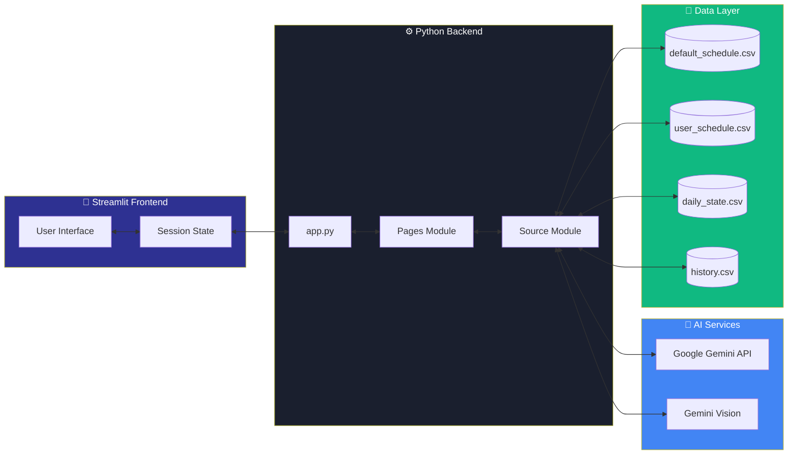

<div align="center">


# 🧠 Neural Plan

**Transform Cancelled Classes into Productive Study Sessions**

[](LICENSE)
[](https://www.python.org/downloads/)
[](https://streamlit.io)
[](https://ai.google.dev/)
[](https://neuralplan.streamlit.app/)

*An AI-powered study planner that adapts to your energy levels and turns wasted time into learning opportunities*

[Features](#-features) • [Quick Start](#-quick-start) • [Architecture](#-architecture) • [Usage](#-usage) • [License](#-license)

</div>

---

## 🎯 Overview

Students waste hours on cancelled classes scrolling social media. **Neural Plan** uses Google Gemini AI to generate energy-adaptive study plans that match your mental state (Low Battery 😴 → Beast Mode 🦁) and track accountability through data-driven insights.

> **Note:** Built as a productivity tool for students to transform wasted time into learning opportunities.

---

## 🎯 The Problem

Students face wasted time when classes are cancelled:
1. **Unproductive scrolling** - Hours lost on social media
2. **No study structure** - Lack of adaptive plans for different energy levels
3. **Zero accountability** - No tracking of actual vs. planned study time

## 💡 Our Solution

Neural Plan combines four powerful features:

- **🤖 AI Study Plans**: 5 energy modes with minute-by-minute breakdowns
- **📸 Vision Parser**: Upload timetable images for automatic extraction
- **📊 Accountability**: Track efficiency with goal vs. actual comparisons
- **🎨 Modern UI**: Glassmorphism design with particle.js animations

---

## 🛠️ Tech Stack

| Component | Technology | Purpose |
|-----------|-----------|------|
| **Frontend** | Streamlit 1.39+ | Rapid web app development |
| **AI Engine** | Google Gemini Flash | Study plan generation & OCR |
| **Data Viz** | Plotly 5.24+ | Interactive charts & graphs |
| **Animations** | Lottie, Particles.js | UI enhancements |
| **Storage** | CSV files | Lightweight data persistence |
| **Language** | Python 3.8+ | Core application logic |

---

---

## ✨ Features

- **🔋 Energy-Adaptive Plans**: 5 modes from Low Battery to Beast Mode
- **📸 Vision OCR**: Automatic timetable extraction from images
- **📊 Efficiency Tracking**: Goal vs. actual time comparisons
- **📈 7-Day Trends**: Visual progress analytics
- **⏰ Minute-by-Minute**: Detailed study breakdowns
- **🎨 Modern UI**: Glassmorphism design with smooth animations

---

---

## 🚀 Quick Start

### Prerequisites
- Python 3.8 or higher
- Google Gemini API key ([Get one here](https://ai.google.dev/))

### Installation

```bash
# Clone the repository
git clone https://github.com/Yuvraj-Sarathe/NeuralPlan.git
cd NeuralPlan

# Install dependencies
pip install -r requirements.txt
```

<details>
<summary><b>🔐 API Key Configuration (Click to expand)</b></summary>

<br>

**Important**: Never commit your API keys to version control!

1. Create a secrets configuration file for Streamlit and add your Gemini API key:
```toml
GEMINI_API_KEY_1 = "your_actual_api_key_here"
```

2. Store this file securely and ensure it's excluded from version control

**Optional**: Add backup keys for automatic rotation on quota limits

</details>

```bash
# Run the application
streamlit run app.py
```

The app will open at `http://localhost:8501`

### First-Time Setup
1. Upload timetable or edit manually in Schedule page
2. Mark classes as "Cancelled" when needed
3. Generate AI study plan in Neural Coach
4. Log actual time in Insights page

---

## 📁 Repository Structure

```
NeuralPlan/
├── app.py                      # Main entry point with session state management
├── requirements.txt            # Python dependencies
├── LICENSE                     # MIT License
│
├── .streamlit/
│   ├── config.toml            # Streamlit theme configuration
│   └── static/
│       └── logo.png           # App logo
│
├── assets/
│   ├── logo.png               # Main logo image
│   ├── animation.json         # Lottie animation data
│   ├── style.css              # Global styles with glassmorphism
│   ├── stylesh.css            # Schedule page specific styles
│   ├── neural_coach.css       # Neural Coach page styles
│   └── data_page.css          # Insights page styles
│
├── data/
│   ├── default_schedule.csv   # Sample timetable (14 classes)
│   └── history.csv            # Sample historical data
│
├── pages/
│   ├── 1_Schedule.py          # Schedule management & upload
│   ├── 2_Neural_Coach.py      # AI study plan generator
│   ├── 3_Insights.py          # Analytics & progress tracking
│   └── 4_Guide.py             # User documentation
│
└── src/
    ├── __init__.py
    ├── gemini_client.py       # Google Gemini API integration
    ├── logo_helper.py         # Logo rendering utilities
    └── utils.py               # Helper functions (time conversion, etc.)
```

---

## 🏗️ Architecture

### System Flow Diagram


Neural Plan follows a modular architecture:
- **Frontend Layer:** Streamlit pages (Schedule, Neural Coach, Insights, Guide)
- **Backend Logic:** Python modules for AI generation and data management
- **Data Layer:** CSV-based storage for schedules, history, and daily state
- **External Services:** Google Gemini API for study plan generation and OCR

### Application Flow

1. User uploads timetable or edits manually
2. Mark cancelled classes in Schedule page
3. Generate energy-adaptive study plans with AI
4. Log actual study time for accountability tracking
5. View efficiency metrics and 7-day trends

### Data Flow Architecture




---

## 📖 Usage

**Schedule**: Upload timetable image or manually edit → Mark cancelled classes → Save

**Neural Coach**: Select subject, time, energy level, focus topic → Generate AI plan

**Insights**: Log actual study minutes → View efficiency score → Analyze trends

---

## 🔧 Configuration

<details>
<summary><b>Theme Customization</b></summary>

Edit `.streamlit/config.toml`:

```toml
[theme]
primaryColor = "#FF8C42"
backgroundColor = "#0E1117"
secondaryBackgroundColor = "#1a1f2e"
textColor = "#e8eaed"
```

</details>

<details>
<summary><b>Data Files Format</b></summary>

**Schedule**:
```csv
Day,Time,Subject,Duration,Status,Actual_Study,Custom_Subject
Monday,09:00 AM,Data Structures,60,Active,0,
```

**History**:
```csv
Date,Time_Saved,Time_Used,Efficiency,Classes_Cancelled
2025-01-01,120,90,75,2
```

</details>

---

## 🐛 Troubleshooting

- **AI not generating**: Check API key in secrets file, verify internet connection, wait for rate limit reset
- **Upload failed**: Use high-resolution images, ensure clear timetable format, or edit manually
- **0% efficiency**: Mark class as "Cancelled" in Schedule page, click "Save Progress"
- **Quota exceeded**: Add backup API keys for automatic rotation

---

## 📝 License

MIT License - see [LICENSE](LICENSE) file

---

## 👥 Team Nerd Herd

<div align="center">


### Built in 7 days for a hackathon challenge

<table>
  <tr>
    <td align="center">
      <a href="https://github.com/SourabhX16">
        <br />
        <sub><b>Sourabh Patne</b></sub>
      </a><br />
      Full-stack development, AI integration, system architecture
    </td>
    <td align="center">
      <a href="https://github.com/siddhikadhanelia">
        <br />
        <sub><b>Siddhika Dhanelia</b></sub>
      </a><br />
      Schedule management, insights dashboard, frontend design
    </td>
  </tr>
  <tr>
    <td align="center">
      <a href="https://github.com/majorsandeep11">
        <br />
        <sub><b>Shlok Pandey</b></sub>
      </a><br />
      Neural Coach, energy modes, data management
    </td>
    <td align="center">
      <a href="https://github.com/Yuvraj-Sarathe">
        <br />
        <sub><b>Yuvraj Sarathe</b></sub>
      </a><br />
      Vision OCR, efficiency tracking, UI/UX design
    </td>
  </tr>
</table>

</div>

---

<div align="center">

**⭐ Star this repo if Neural Plan helped you reclaim wasted time!**

**Made with ❤️ and ☕ by Team Nerd Herd | Neural Plan © 2025**

*Transforming cancelled classes into productive study sessions.* 🧠

</div>

